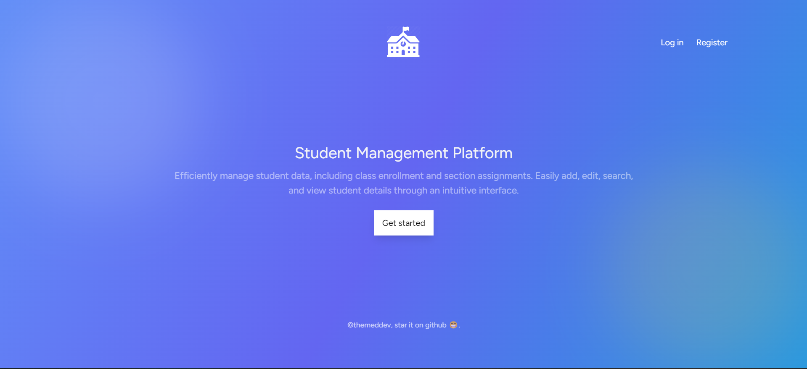

# Student Management System



This project is a **Student Management System** built using **Laravel**, **Vue.js**, **Inertia.js**, and **SQLite**. The system allows users to manage student data, including adding, updating, deleting, and viewing students. Pagination and search functionality are also provided.

## Features
- View a list of all students
- Add new students
- Edit student details
- Delete students
- Search students by name or email
- Pagination support for large datasets

## Prerequisites

Before setting up this project, ensure you have the following installed:

- [PHP 8.1+](https://www.php.net/downloads)
- [Composer](https://getcomposer.org/download/)
- [Node.js 16+](https://nodejs.org/en/download/)
- [NPM](https://www.npmjs.com/get-npm)

## Installation

Follow these steps to install and run the project locally.

### 1. Clone the Repository

```bash
git clone https://github.com/themeddev/inertia-vue-students-management
cd inertia-vue-students-management
```

### 2. Install PHP Dependencies
Run the following command to install all the PHP dependencies using Composer.

```bash
composer install
```

### 3. Install NPM Dependencies
Run the following command to install all the necessary Node.js dependencies.

```bash
npm install
```

### 4. Set Up Environment Variables
#### Create a .env file by copying .env.example and configure your database settings.

```bash
cp .env.example .env
```

#### For SQLite, update the database configuration in your .env file like so:

```bash
DB_CONNECTION=sqlite
DB_DATABASE=/absolute/path/to/your/database/database.sqlite
```

#### Ensure that the database.sqlite file exists. You can create it in the database folder:

```bash
touch database/database.sqlite
```

### 5. Run Migrations
Run the database migrations to set up the required tables.

```bash
php artisan migrate
```

### 6. Build the Frontend
Compile the front-end assets using the following command:

```bash
npm run dev
```
This will also enable hot-reloading while you're developing the project.

### 7. Start the Laravel Development Server
To start the server, run:

```bash
php artisan serve
```
Now visit http://localhost:8000 in your browser.


#### Usage
- Add Student: Click on the "Add Student" button to add a new student.
- Edit Student: Click the "Edit" button beside a student's details to edit their information.
- Delete Student: Click the "Delete" button to remove a student.
- Search Students: Use the search box to find students by name or email.
#### Technologies Used
- Laravel 11: Backend framework for managing students and handling HTTP requests.
- Vue.js 3: Reactive JavaScript framework for the frontend, used in conjunction with Inertia.js.
- Inertia.js: Allows seamless integration between Laravel and Vue.js, providing a smooth SPA experience.
- SQLite: A lightweight, file-based database system used for data storage.
#### License
This project is licensed under the MIT License. See the LICENSE file for details.


